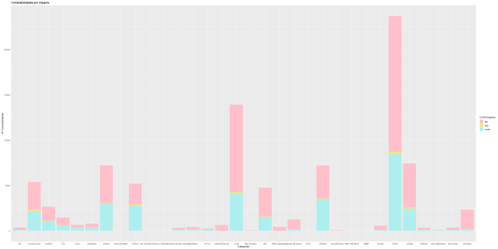

```{r setup, include=FALSE}
knitr::opts_chunk$set(echo = TRUE)

library(readr)
library(dplyr)
library(tidyr)
library(ggplot2)
library(RColorBrewer)
```

Para la realización de esta entrega, partimos de la base de datos de vulnerabilidades de Qualys.

## 1. Leer Archivo CSV
En primer lugar leeremos el archivo csv donde se encuentran las vulnerabilidades, y lo convertiremos en un dataframe.

```{r eval=TRUE, echo=FALSE}
csv <- read_csv("DL_vulnerabilities_abtes2mv_20191217.csv", skip = 3)

```

## 2. Eliminar campos no relevantes
En segundo lugar, una vez leído el archivo, nos quedaremos con los siguientes campos: QID, CVE ID, Category, SubCategory, CVSS Base y CVSS3 Base.

```{r eval=TRUE}
my_df <- select(csv,QID,matches("CVE ID"),Category,matches("Sub Category"),matches("CVSS Base"),matches("CVSS3 Base"))
```

## 3. Eliminar filas incompletas
A continuación, eliminaremos aquellas filas del dataframe que tienen campos incompletos para evitar que entorpezcan nuestro análisis.

```{r eval=TRUE}
df <- filter(my_df, !is.na(my_df$`CVE ID`))
df <- filter(df, df$`CVSS Base` != '\'-')
df <- filter(df, df$`CVSS3 Base` != '\'-')
```

## 4. Dividir campo CVE ID
Para aquellas columnas correspondientes al 'CVE ID' que tengan más de un cve, las dividiremos en varias filas replicando la información de la fila para cada cve distinto.

```{r eval=TRUE}
df_elegant <- strsplit(df$`CVE ID`, split = ",")
elegant_data <- data.frame(QID = rep(df$QID, sapply(df_elegant, length)), `CVE ID`  = unlist(df_elegant), Category = rep(df$Category, sapply(df_elegant, length)), `Sub Category` = rep(df$`Sub Category`, sapply(df_elegant, length)), `CVSS Base`  = rep(df$`CVSS Base`, sapply(df_elegant, length)), `CVSS3 Base`  = rep(df$`CVSS3 Base`, sapply(df_elegant, length)))
```

## 5.Ordenar las vulnerabilidades por categoría
En quinto lugar, ordenamos las vulnerabilidades en función de la categoría a la que pertenecen.

```{r eval=TRUE}
order_by_category <- arrange(elegant_data, elegant_data$Category)

```

## 6. Convertir CVSS Base y CVSS3 Base a tipo numérico
A continuación, cambiamos el tipo de dato de las columnas 'CVSS Base' y 'CVSS3 Base' de 'factor' a 'numeric'

```{r eval=TRUE}
order_by_category$CVSS.Base <- as.numeric(as.character(order_by_category$CVSS.Base))
order_by_category$CVSS3.Base <- as.numeric(as.character(order_by_category$CVSS3.Base))

```

## 7. Agrupar vulnerabilidades en función de su impacto
Basándonos en el estándar CVSS, agruparemos las vulnereabilidades por la categoría a la que pertenecen contando el número de ellas que tienen un impacto alto un impacto medio y un impacto bajo.

```{r eval=TRUE}
cvss_impact_df <- order_by_category %>% group_by(Category) %>% summarise(high = sum(CVSS.Base >= 7.0),
                                                       medium = sum((CVSS.Base > 3.9) & (CVSS.Base < 7.0)),
                                                       low = sum((CVSS.Base <= 3.9))
                                                       )
```

## 8. Extraer observaciones y ordenar dataframe
De las columnas obtenidas anteriormente según el impacto, se procede a extraer observaciones a partir de esas variables. 

```{r eval=TRUE}
cvss_impact_df <- gather(cvss_impact_df,"CVSS_Impact","num_cves",2:4)

```
Finalmente se ordena el dataframe en función de la categoría.

```{r eval=TRUE}
cvss_impact_order_df <- arrange(cvss_impact_df, cvss_impact_df$Category)

```

## 9. Construír gráfico
Antes de contruír el gráfico se definen los colores que se van a utilizar.

```{r eval=TRUE}
my_colors <- list("#FFC0CB","#F0E68C","#AFEEEE")

```
Se construye el gráfico que representa el número de vulnerabilidades por categoría, y cada color se corresponde con el impacto que tienen estas vulnerabilidades.

```
ggplot(data=cvss_impact_order_df, aes(x=cvss_impact_order_df$Category, y=cvss_impact_order_df$num_cves, fill=cvss_impact_order_df$CVSS_Impact)) + 
  geom_bar(stat="identity") +
  scale_fill_manual(values = my_colors) +
  labs(title="Vulnerabilidades por Impacto", fill="CVSS Impacto") + 
  xlab("Categorías") + 
  ylab("Nº Vulnerabilidades")

```


