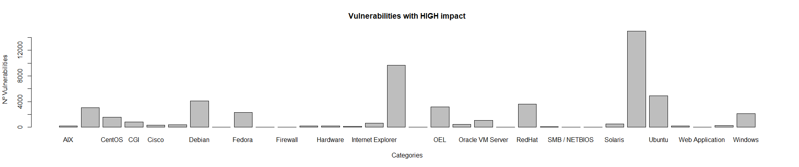

```{r setup, include=FALSE}
knitr::opts_chunk$set(echo = TRUE)

library(readr)
library(dplyr)
```

Para la realización de esta entrega, partimos de la base de datos de vulnerabilidades de Qualys.

## 1. Leer Archivo CSV
En primer lugar leeremos el archivo csv dónde se encuentran las vulnerabilidades y lo convertiremos en un dataframe

```
csv <- read_csv("DL_vulnerabilities_abtes2mv_20191217.csv", skip = 3)

```

## 2. Eliminar campos no relevantes
En segundo lugar, una vez leído el archivo, nos quedaremos con los siguientes campos: QID, CVE ID, Category, SubCategory, CVSS Base y CVSS3 Base.

```
my_df <- select(csv,QID,matches("CVE ID"),Category,matches("Sub Category"),matches("CVSS Base"),matches("CVSS3 Base"))
```

## 3. Eliminar filas incompletas
A continuación, eliminaremos aquellas filas del dataframe que tienen campos incompletos.

```
df <- filter(my_df, !is.na(my_df$`CVE ID`))
df <- filter(df, df$`CVSS Base` != '\'-')
df <- filter(df, df$`CVSS3 Base` != '\'-')
```

## 4. Dividir campo CVE ID
Para aquellas columnas correspondientes al 'CVE ID' que tengan más de un cve, las dividiremos en varias filas replicando la información de la fila para cada cve distinto.

```
df_elegant <- strsplit(df$`CVE ID`, split = ",")
elegant_data <- data.frame(QID = rep(df$QID, sapply(df_elegant, length)), `CVE ID`  = unlist(df_elegant), Category = rep(df$Category, sapply(df_elegant, length)), `Sub Category` = rep(df$`Sub Category`, sapply(df_elegant, length)), `CVSS Base`  = rep(df$`CVSS Base`, sapply(df_elegant, length)), `CVSS3 Base`  = rep(df$`CVSS3 Base`, sapply(df_elegant, length)))
```

## 5.Ordenar las vulnerabilidades por categoría
En quinto lugar, ordenamos las vulnerabilidades en función de la categoría a la que pertenecen.

```
order_by_category <- arrange(elegant_data, elegant_data$Category)
```

## 6. Convertir CVSS Base y CVSS3 Base a tipo numérico
A continuación, cambiamos el tipo de dato de las columnas 'CVSS Base' y 'CVSS3 Base' de 'factor' a 'numeric'

```
order_by_category$CVSS.Base <- as.numeric(as.character(order_by_category$CVSS.Base))
order_by_category$CVSS3.Base <- as.numeric(as.character(order_by_category$CVSS3.Base))
```

## 7. Diferenciar vulnerabilidades en función de su impacto
Basándonos en el estándar CVSS, aquellas vulnerabilidades que tienen un impacto más alto soon aquellas cuya puntuación es igual o superior a 7. Por tanto, vamos a quedarnos con aquellas vulnerabilidades cuyo impacto sea alto.

```
critic_cves <- filter(order_by_category, order_by_category$CVSS.Base >= 7.0)
```

## 8. Construir gráfico
Construiremos un gráfico con la infomración obtenida en el que se podrán observar el número de vulnerabilidades, por categoría, que tienen un impacto alto.

```
plot(x = critic_cves$Category)
```
